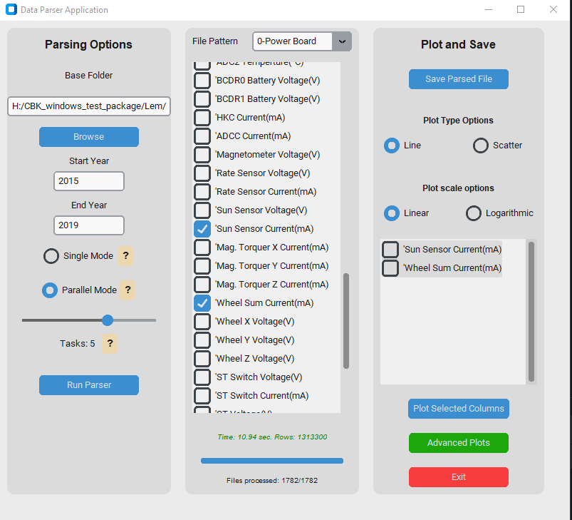
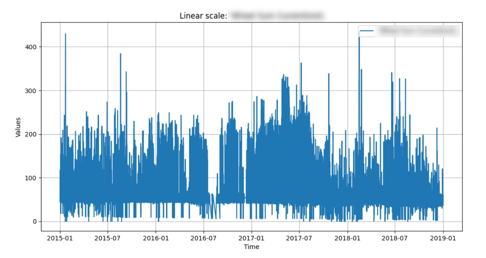

# Data Parser and Plotting Application

## Table of Contents
- [Overview](#overview)
- [Installation](#installation)
- [Using the Application](#using-the-application)
  - [Step 1: Loading Data](#step-1-loading-data)
  - [Step 2: Configuring the Parser](#step-2-configuring-the-parser)
  - [Step 3: Running the Parser](#step-3-running-the-parser)
  - [Step 4: Plotting Data](#step-4-plotting-data)
  - [Optional: Saving Parsed Data](#optional-saving-parsed-data)
  - [Step 5: Advanced Plots](#step-5-advanced-plots)
- [Source of Data](#source-of-data)
- [Data Format](#data-format)
- [Acknowledgements](#acknowledgements)

---

## Overview
This application is designed to help Scientists from the Polish Space Research Centre (CBK PAN) efficiently process housekeeping datasets from the Lem and Heweliusz satellites. The primary goal is to enable the extraction and visualization of specific data columns from CSV files containing over 30GB of satellite telemetry data.

Key features include:
- Parsing and filtering CSV data based on selected columns.
- Support for single-process and multi-process data processing.
- Interactive plotting with linear and logarithmic scales.
- User-friendly interface for quick navigation and data handling.

---

### Source of Data
The data originates from the Lem and Heweliusz satellites. However, the raw data cannot be made publicly available.

- **LEM Satellite**: A Polish satellite launched in 2013, primarily designed for stellar photometry and astrophysical observations.
- **HEWELIUSZ Satellite**: Launched in 2014, Heweliusz complements Lem's mission with additional capabilities for space environment monitoring. Housekeeping dataset spans from their launch dates to the present, amounting to over 30GB of CSV files.

Daily sunspots number from http://sidc.oma.be/silso/datafiles

### Data Format
The files are organized in a hierarchical structure. For example:

<pre>
base_folder/
├── 2020-01/
│   ├── 2020-01-01/
│   │   ├── 0-Power Board-20200101.csv
│   │   ├── 1-BCDR0-20200101.csv
│   │   └── ...
│   ├── 2020-01-02/
│   │   ├── 0-Power Board-20200102.csv
│   │   └── ...
│   └── ...
├── 2020-02/
│   └── ...
</pre>

Each file contains time-series data with columns such as:
- `'Date (YYYY-MM-DD HH:MM:SS)`': Timestamp of the data.
- `'Date (J2000 mseconds)`': Time in milliseconds since J2000 epoch.
- Specific housekeeping parameters (e.g., temperatures, currents).

---

## Installation
To run the application, follow these steps:

1. **Download the application**
   - Download `win_app` or `linux_app`.
2. **Run the executable**
   - double-click `win_app.exe` located in win_app or `linux_app` located in linux_app to launch the application.

3. **System requirements**
   - At least 8GB of RAM (recommended for larger datasets).
   - A quad-core processor (4 cores) or higher is recommended for efficient parallel processing.
  
4. **Security notice**
   - Some anti-virus programs may block an application from an unknown source. If you receive a warning about a potential threat, please note that this project is fully open source — you are free to review the code yourself and confirm its safety. If you have any doubts, questions, or issues regarding the safety feel free to contact me.
---

## Using the Application
<h2 align="center">Application Interface in Windows</h2>

  

  <!-- Mały odstęp -->

<h2 align="center">Application Interface in Linux</h2>

  

### Step 1: Loading Data
1. Launch the application by running the executable file.
2. Click the **Browse** button to select the folder containing your satellite data files. For efficiency, select WOD/Parsed specifically.

### Step 2: Configuring the Parser
1. Use the **Start Year** and **End Year** fields to filter data by year. These fields are optional and can be left empty to include all available data.
2. Select a **File Pattern** to narrow down the type of data you want to parse (e.g., "0-Power Board").
3. Check the desired columns in the Select Columns section to include them in the output. The first three columns, which pertain to the reading timestamp, are included by default and dont need to be selected manually.
4. Choose a processing mode:
   - **Single-process mode**: Processes files one by one (useful for small datasets).
   - **Parallel processing mode**: Enables faster processing by using multiple CPU cores. You can specify the number of tasks in the **Parallel Tasks** field.

### Step 3: Running the Parser
1. Click **Run Parser** to start the data processing.
2. Monitor the progress using the progress bar and file count indicator.
3. Once completed, the parsed data will be ready for plotting or saving.

### Step 4: Plotting Data
1. Choose one or more columns to plot.
2. Select a scale:
   - **Linear**: Standard scale.
   - **Logarithmic**: For data with a wide range of values.
3. View the interactive plot. Use the red cursor to inspect specific points or zoom it without losing quality.

<h2 align="center">Plot Examples</h2>

  

  

### Optional: Saving Parsed Data
1. Click **Save Parsed File** to export the parsed data as a CSV file.
2. Choose the destination and filename in the save dialog.

### Step 5: Advanced Plots
1. Click the **Advanced Plots** button to open advanced plotting window.
2. On left panel, parsed dataframes will appear. Click Refresh if needed.
3. In the middle panel, select two dataframes and choose specific columns.
4. Set Plot Options
5. (Optional) Check **Add Solar Data** to include number of sunspots in plot.
6. **Click Comparison** Plot to generate plot.

<h2 align="center">Advanced Plots Window</h2>

  

<h2 align="center">Example Comparison Plot</h2>

  

---

## Acknowledgements
This tool was developed to simplify the analysis of satellite telemetry data. Special thanks to the teams behind LEM and HEWELIUSZ for providing necessary satellite telemetry data.

For further inquiries or bug reports, please contact jedrzejslupski@gmail.com
